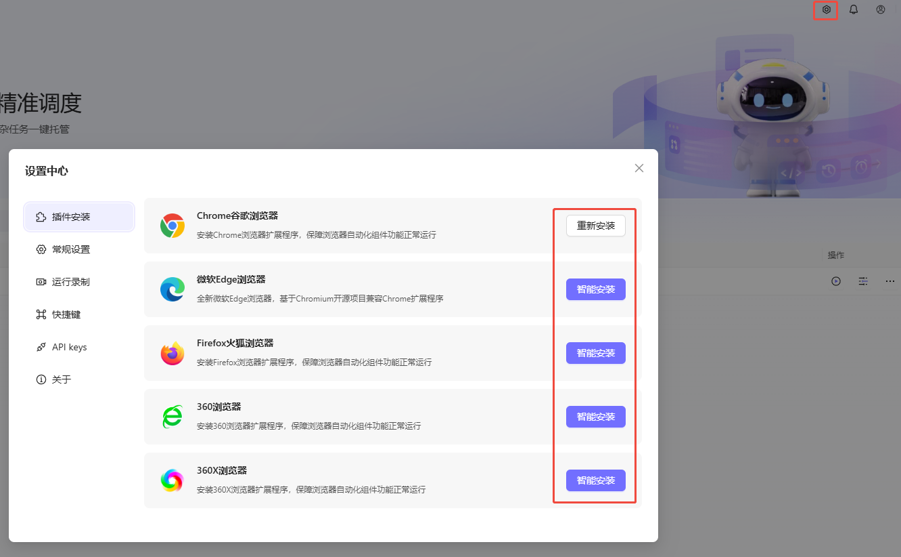

# 🤖 Astron RPA Frequently Asked Questions (FAQ)

## 📚 Table of Contents

- [🔧 Installation & Deployment](#-installation--deployment)
- [👥 Client Related](#-client-related)
- [⚡ Performance & Loading](#-performance--loading)
- [📖 Feature Usage](#-feature-usage)
- [🐛 Troubleshooting](#-troubleshooting)
- [📞 Get Help](#-get-help)

---

## 🔧 Installation & Deployment

### Q: Can the open-source client run on Linux?

**A:** ❌ **Not yet!** The open-source version of Astron RPA client currently only supports Windows systems.

**Supported Systems:**
- ✅ Windows 10/11

---

## 👥 Client Related

### Q: Do I need to install a client?

**A:** ✅ **Yes!** RPA currently doesn't have a web version and requires a client to run.

---

### Q: Do I have to manually build the client?

**A:** ✅ **No!** You can download the msi installer package directly from the [Release version](https://github.com/iflytek/astron-rpa/releases) and install it directly.

---

### Q: How do I quickly deploy the latest code?

**A:** 

#### Server Update Method 1️⃣: Quick Update (Download Latest Image)

Best for production environments, the fastest and simplest update method.

```bash
# 1. Stop old containers
docker-compose down

# 2. Remove old images (optional, to clean up local images)
docker rmi ghcr.io/iflytek/astron-rpa/openapi-service:latest
docker rmi ghcr.io/iflytek/astron-rpa/ai-service:latest
docker rmi ghcr.io/iflytek/astron-rpa/robot-service:latest

# 3. Start new containers and automatically download latest images
docker-compose up -d
```

#### Server Update Method 2️⃣: Local Build (For Developers)

Allows customization, suitable for development and testing environments.

```bash
# 1. Pull the latest code
git pull origin main

# 2. Enter docker directory
cd docker

# 3. Edit docker-compose.yml
# - Comment out the image line
# - Uncomment the build section

# Example configuration:
# services:
#   openapi-service:
#     # image: ghcr.io/iflytek/astron-rpa/openapi-service:latest
#     build:
#       context: ..
#       dockerfile: backend/openapi-service/Dockerfile

# 4. Build and start locally
docker-compose up -d --build

# 5. Wait for build to complete (may take several minutes)
docker-compose logs -f
```

> 💡 **Update Tips:** 
> - Method 1️⃣ is fastest, suitable for production
> - Method 2️⃣ allows customization, suitable for developers
> - Database data is preserved during updates (mysql container data in volumes)

#### Server Update Method 3️⃣: Update Database with ATLAS

Quickly update database schema by starting the ATLAS container for automatic migration.

```bash
# 1. Start the ATLAS container for database migration
docker-compose up -d atlas

# 2. View ATLAS migration logs (ensure migration succeeded)
docker-compose logs -f atlas
```

> 💡 **About ATLAS:**
> - ATLAS is a database version management tool for automatically executing database migration scripts
> - Each server update may include database schema changes that need to be applied via ATLAS
> - Existing data in the database is preserved; only table structures and schema are updated

---

#### Client Update Method 1️⃣: Update Python Packages Directly

Quick development iteration, only updating specific packages.

If you've modified Python packages in the `engine` directory (such as `workflowlib`, `executor`, etc.), you can copy them directly to the client's Python environment:

```bash
# Example: updating workflowlib
# 1. Find the source code location
# engine/shared/astronverse-workflowlib

# 2. Copy to client installation directory
# From: \astron-rpa\engine\shared\astronverse-workflowlib\src\astronverse\workflowlib
# To: C:\Program Files\Astron RPA\data\python_core\Lib\site-packages\astronverse\workflowlib
```

**Common Packages and Locations:**

| 📦 Package | 📂 Source Code Location | 🎯 Target Location |
|---------|----------|--------|
| workflowlib | `engine/shared/astronverse-workflowlib/src/astronverse/workflowlib` | `<install_dir>/data/python_core/Lib/site-packages/astronverse/workflowlib` |
| executor | `engine/servers/astronverse-executor/src/astronverse/executor` | `<install_dir>/data/python_core/Lib/site-packages/astronverse/executor` |
| browser | `engine/components/astronverse-browser/src/astronverse/browser` | `<install_dir>/data/python_core/Lib/site-packages/astronverse/browser` |
| other packages | `engine/<?>/astronverse-*/src/astronverse/*` | `<install_dir>/data/python_core/Lib/site-packages/astronverse/*` |

> 💡 **Restart Tip:** 
> - If updating packages in Servers, you need to restart the client to load the new packages

---

#### Client Update Method 2️⃣: Repackage and Reinstall

Use this when updating multiple packages or need a complete version update.

If you've made extensive changes or want to fully update the client, you can use `build.bat` to package a new client msi installer:

```bash
# 1. Run in the project root directory
.\build.bat

# 2. Wait for build to complete (may take 10-30 minutes)
# New msi installer will be generated in build/dist/ directory

# 3. Use the newly generated msi installer to reinstall
# - Run build/dist/*.msi file directly
# - Or replace it in the release directory for other users to download
```

---

#### Update Methods Comparison

| 🔄 Update Method | 🎯 Use Case | ⚡ Speed | 📚 Complexity |
|---------|---------|------|--------|
| Copy Python packages directly | Quick dev iteration, only update specific packages | 🚀 Fast | 🟢 Simple |
| Repackage msi | Multiple packages update, need complete version | 🐢 Slow | 🟡 Medium |
| Download new Release | New version release, production environment | 🔄 Medium | 🟢 Simple |

> 💡 **Best Practices:** 
> - 🔨 **Development Phase** → Use "Copy packages" for quick iteration
> - ✅ **Feature Complete** → Use "build.bat" to package as complete installer
> - 🚀 **Production** → Use official Release version

---

## ⚡ Performance & Loading

### Q: Why does the software hang on loading?

**A:** 

**Here are some situations encountered in practice:**

#### 1️⃣ **remote_addr** not modified in conf.yaml

**❌ Symptom:** Client hangs on loading page

**✅ Solution:** After installation, modify the server address in `resources/conf.yaml` in the installation directory:

```yaml
# 32742 is the default port, change if modified
remote_addr: http://YOUR_SERVER_ADDRESS:32742/
skip_engine_start: false
```

---

#### 2️⃣ Server hasn't fully started up yet

**❌ Symptom:** Newly started service is still initializing

**✅ Solution:** Wait a while and then restart the client

---

#### 3️⃣ CASDOOR_EXTERNAL_ENDPOINT not modified in .env

**❌ Symptom:** Authentication service cannot be accessed

**✅ Solution:**

```bash
# Modify casdoor service configuration in .env (8000 is the default port)
CASDOOR_EXTERNAL_ENDPOINT="http://{YOUR_SERVER_IP}:8000"
```

---

## 📖 Feature Usage

### Q: Why can't I capture web elements? Why does web automation always fail?

**A:** 

🔴 **Most likely you haven't installed the browser plugin**



For more web automation information, see the [Official Guide](https://www.iflyrpa.com/docs/quick-start/web-automation.html)

---

### Q: How do I use AI capabilities in workflows?

**A:** 

Before using AI atomic capabilities, you need to configure the corresponding AI parameters when deploying the server.

```yaml
# Large model URL and corresponding API_KEY (compatible with OpenAI format)
AICHAT_BASE_URL="https://api.deepseek.com/v1/"
AICHAT_API_KEY="sk-xxxxxxxxxxxxxxxxxxxxxxx"

# Iflytek Cloud OCR authentication method (get from official website)
XFYUN_APP_ID=dxxxxx38
XFYUN_API_SECRET=ZTFxxxxxxxxxxxxxxxxNDVm
XFYUN_API_KEY=c4xxxxxxxxxxxxxxxx8a7

# Yunma CAPTCHA authentication method
JFBYM_ENDPOINT="http://api.jfbym.com/api/YmServer/customApi"
JFBYM_API_TOKEN="xxxxxxxxxxxxxxxxxxxxxxxxxxxxxx"
```

> ⚠️ **Important:** Restart the server after configuration to ensure it takes effect

---

### Q: How do I make external calls? How do I use MCP?

**A:** 

For external calls, the official [documentation](https://www.iflyrpa.com/docs/open-api/overview.html) has detailed descriptions and API documentation.

The only thing to note is that all URLs need to be changed from the official domain to your own server domain.

```bash
# Official version:
https://newapi.iflyrpa.com/api/rpa-openapi/workflows/get

# Open-source version:
http://{IP_ADDRESS}:32742/api/rpa-openapi/workflows/get
```

> 📌 **Reminder:** All robots that need to be called externally need to be published in the designer first, then configured for external calls in the executor

---

## 🐛 Troubleshooting

### Q: How do I collect diagnostic information?

**A:** 

When encountering problems, query the server and engine logs:

```bash
# 1️⃣ Query Docker logs
docker ps -a
docker logs [container_name] > logs.txt

# 2️⃣ Query client logs
# Logs are saved in: installation_directory\data\logs
# If software is installed on C drive: %APPDATA%\astron-rpa\logs
```

---

## 📞 Get Help

### 🌐 Official Channels

| Channel | Link | Response Time |
|------|------|---------|
| 🐙 GitHub Issues | [Submit Issue](https://github.com/iflytek/astron-rpa/issues) | 24-48 hours |
| 💬 Discussions | [Discussion Forum](https://github.com/iflytek/astron-rpa/discussions) | Within a week |

### 📚 Useful Resources

- 🏠 [Project Homepage](https://github.com/iflytek/astron-rpa)
- 📖 [Project Introduction](./README.md)
- 📝 [Complete Installation Guide](./BUILD_GUIDE.md)
- 🐳 [Docker Deployment Guide](./docker/QUICK_START.md)
- 👨‍💻 [Usage Guide](https://www.iflyrpa.com/docs)

---

## 🔄 Update History

| Version | Date | Content |
|------|------|---------|
| v1.0 | 2025-11-26 | Initial Release |
| v1.1 | TBD | Will add more FAQs |

---

> ⏰ **Last Updated:** 2025-11-26  
> 👤 **Maintainer:** DoctorBruce  
> 📜 **License:** Apache-2.0

